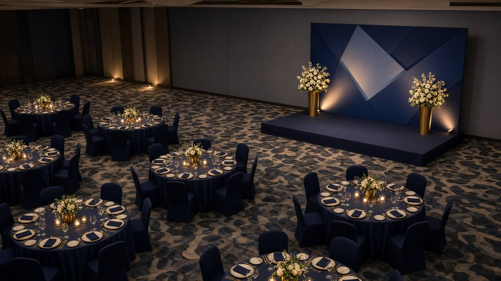

<p align="center">
  
</p>

<p align="center">
  <a href="https://img.shields.io/badge/Noida-Sector%208-0B6FE8?style=for-the-badge"></a>
  <a href="https://img.shields.io/badge/Digital%20Marketing-071426?style=for-the-badge"></a>
  <a href="https://img.shields.io/badge/Social-0B6FE8?style=for-the-badge"></a>
  <a href="https://img.shields.io/badge/Events-084A9E?style=for-the-badge"></a>
  <a href="https://img.shields.io/badge/Software-3EB6FF?style=for-the-badge"></a>
</p>

<h1 align="center">Digital Marketing, Software & Growth Systems for Businesses</h1>

<p align="center">
  MKSAnalytIQ helps businesses generate leads, build their digital presence and launch digital products —<br>
  combining marketing, technology and growth under one roof. Studio in Sector 8, Noida.
</p>

<p align="center">
  <a href="mailto:hello@mksanalytiq.in?subject=Quote%20request"><b>Book a free consultation</b></a>
  &nbsp;·&nbsp;
  <a href="https://wa.me/919560814623"><b>WhatsApp</b></a>
  &nbsp;·&nbsp;
  <a href="tel:+919560814623"><b>Call +91 95608 14623</b></a>
</p>

<p align="center">
  Based in Noida · Serving businesses across India
</p>

---

## Everything you need to build and grow online

Creativity, technology and a report you can read. One studio for the campaign and the thing it points to.

<table>
  <tr>
    <td width="50%" valign="top">
      <br>
      <h3>Digital Marketing</h3>
      Campaigns built around a number you care about — leads, bookings, or sales — not a pile of vanity posts.
      <ul>
        <li>Meta and Google campaigns with weekly reporting</li>
        <li>Offer, landing page and follow-up as one system</li>
        <li>Audience, creative and budget you can see</li>
      </ul>
    </td>
    <td width="50%" valign="top">
      <br>
      <h3>Social Media Management</h3>
      A steady presence on the platforms your customers already use, in your voice, on a calendar you approve.
      <ul>
        <li>Monthly content plan, reels and stills</li>
        <li>Community replies and comment moderation</li>
        <li>Creator coordination when it fits</li>
      </ul>
    </td>
  </tr>
  <tr>
    <td width="50%" valign="top">
      <br>
      <h3>Event Management</h3>
      Launches, corporate gatherings and community programmes — planned on the ground and promoted before the doors open.
      <ul>
        <li>Run of show, vendors and on-site coordination</li>
        <li>Invites, registration and reminder messages</li>
        <li>Recap content and post-event follow-up</li>
      </ul>
    </td>
    <td width="50%" valign="top">
      <br>
      <h3>Software and app development</h3>
      Websites, dashboards and product software your team can actually run — from a public site to a working product.
      <ul>
        <li>Marketing sites, portals and internal tools</li>
        <li>Mobile-ready web apps and API integrations</li>
        <li>Handover with a repository you own</li>
      </ul>
    </td>
  </tr>
</table>

Also in the brief when you need them: **SEO and content**, **brand and design**, and a monthly **analytics** read of what moved.

---

## Your digital growth partner

<table>
  <tr>
    <td width="58%" valign="top">
      
    </td>
    <td width="42%" valign="top">
      <h3>Manoj Kumar Singh</h3>
      <p>Proprietor. Manoj leads the brief, the quote and the handover himself.</p>
      <p>MKSAnalytIQ is for owners who are tired of hiring four vendors who never speak to each other. Marketing that can be measured, social that sounds like you, events that fill the room, and software your team keeps after launch.</p>
      <p>
        <a href="https://www.google.com/maps/search/?api=1&query=C-81+C+Block+Sector+8+Noida+Uttar+Pradesh+201306"><b>C-81, C Block, Sector 8, Noida, Uttar Pradesh 201306</b></a>
      </p>
    </td>
  </tr>
</table>

| | | | |
|---|---|---|---|
| **Noida** | **One team** | **Direct** | **India** |
| Sector 8 studio | Marketing and technology | Work with the proprietor | Projects beyond the city |

---

## Projects that make an impact

Public software from the studio. Client marketing and private event work stays off this list — ask on a call for relevant examples.

| Project | What it is | |
|---|---|---|
| **[ShortGen](https://github.com/SparkxDating/ShortGen)** | Multi-tenant SaaS that turns a topic into short-form video. | [Live](https://shortgen-pi.vercel.app) |
| **[Open CPaaS](https://github.com/SparkxDating/cpaas)** | Messaging, verify, voice, email, provider routing and an Android SMS gateway. | [Repo](https://github.com/SparkxDating/cpaas) |
| **[TaxPilot AI](https://github.com/SparkxDating/taxpilot-ai)** | Guided ITR-3 / ITR-4 preparation for AY 2026–27, with official ITR-4 JSON export. | [Live](https://taxpilot-ai-beta.vercel.app) |
| **[Eye camp registration](https://github.com/SparkxDating/QRLogin)** | Hindi, mobile-first registration for a free cataract camp in Varanasi — slips, QR codes and an admin desk. | [Repo](https://github.com/SparkxDating/QRLogin) |
| **[Navi Zindagi](https://github.com/SparkxDating/Navizindagi)** | Fundraising and volunteer site for flood-relief work in Nepal and Assam. | [Repo](https://github.com/SparkxDating/Navizindagi) |
| **[AI Influencer OS](https://github.com/SparkxDating/ai-influencer-os)** | Workspace to draft influencer content, approve posts and keep sponsored captions disclosed. | [Repo](https://github.com/SparkxDating/ai-influencer-os) |

More on [github.com/SparkxDating](https://github.com/SparkxDating).

---

## Five steps. No mystery month.

| | | |
|---|---|---|
| **01 Discover** | **02 Plan** | **03 Build** |
| A call or a visit. Offer, audience, deadline, and what “done” looks like. | A short scope: channels, pages or event flow, timeline and fee. You approve it first. | Creative, code or on-ground production. You see work in progress. |
| **04 Launch** | **05 Improve** | **What you leave with** |
| Campaigns go live, the site ships, or the event opens. We stay on the thread. | Keep what worked, cut what didn’t, and set the next month. | A written scope, files in your name, and a note on what moved. |

---

## Ready to take the business to the next level?

<p align="center">
  
</p>

<p align="center">
  Tell us the project. We’ll say plainly whether we should do it, and what the first month looks like.
</p>

<p align="center">
  <a href="mailto:hello@mksanalytiq.in"><b>hello@mksanalytiq.in</b></a><br>
  <a href="tel:+919560814623"><b>+91 95608 14623</b></a><br>
  <a href="https://wa.me/919560814623"><b>WhatsApp</b></a><br>
  <a href="https://www.google.com/maps/search/?api=1&query=C-81+C+Block+Sector+8+Noida+Uttar+Pradesh+201306"><b>Open the studio in Maps</b></a>
</p>

---

<details>
<summary><b>Run this website locally</b></summary>

<br>

```bash
npm install
npm run dev
```

The dev server listens on port `8080`. Pages live in `src/routes`. Company copy is in `src/lib/content.ts`.

</details>

<p align="center">
  <sub>© MKSAnalytIQ · Proprietorship of Manoj Kumar Singh · Noida</sub>
</p>
